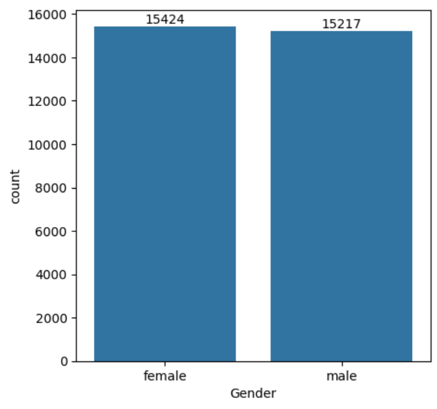
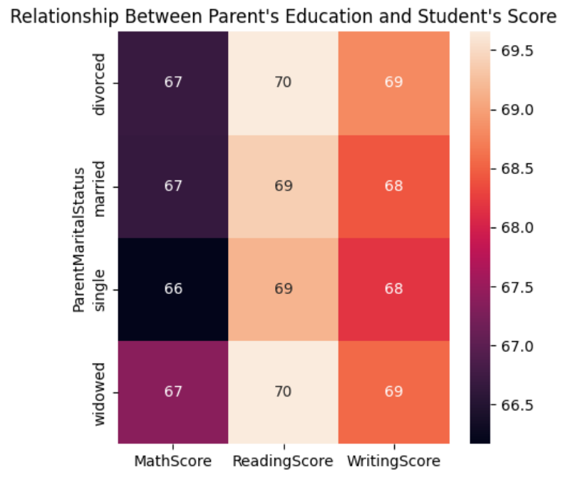
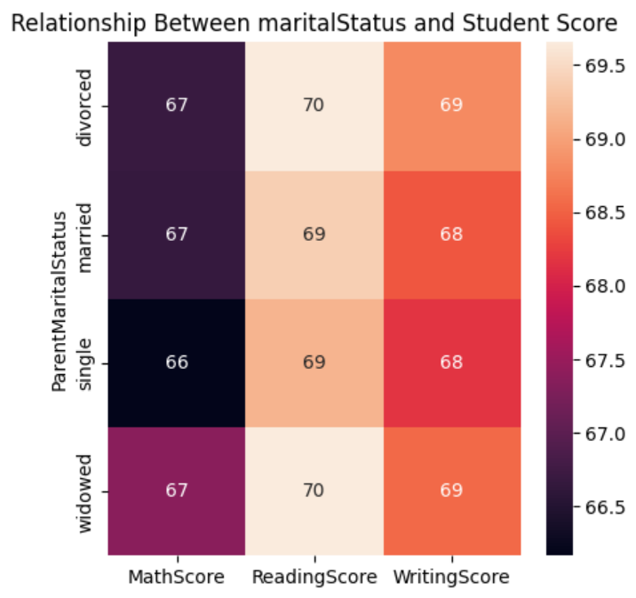
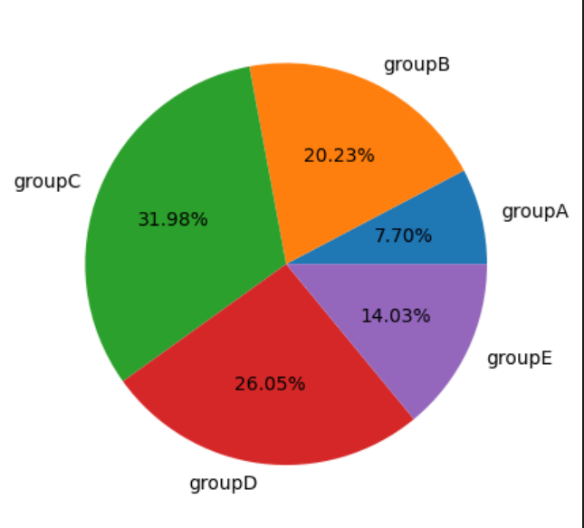

# Student Result Analysis with Python & Data Visualization

This project focuses on analyzing student performance data using Python and data visualization techniques. The analysis is done through key insights into gender distribution, parent education's effect on student scores, and group-wise performance breakdowns. The project highlights how demographic data correlates with academic success using visualization tools.

## Overview

The **Student Result Analysis** project explores and visualizes various aspects of student performance, such as gender distribution, how parent's education and marital status influence student performance, and performance among student groups. 

The key objectives include:
- Understanding how demographic factors relate to academic scores.
- Creating intuitive visualizations to represent data-driven insights.

## Technologies Used

- **Python**: For data analysis and processing.
- **Pandas**: For data manipulation.
- **Matplotlib & Seaborn**: For creating visualizations and graphs.
- **Jupyter Notebook**: For interactive data analysis.

## Key Visualizations

### 1. Gender Distribution
A bar chart representing the number of male and female students.

### 2. Parent's Education vs Student Scores
A heatmap showing the correlation between Education status and student scores across Math, Reading, and Writing.

### 2. Parent's Marital Status vs Student Scores
A heatmap showing the correlation between parent's marital status and student scores across Math, Reading, and Writing.

### 3. Group-wise Performance Breakdown
A pie chart illustrating the percentage of students belonging to different groups based on their performance.

## Contributing

Contributions are welcome! Please follow these steps to contribute:

1. Fork the repository.
2. Create your feature branch: `git checkout -b feature-branch-name`.
3. Commit your changes: `git commit -m 'Add feature'`.
4. Push to the branch: `git push origin feature-branch-name`.
5. Open a pull request.
